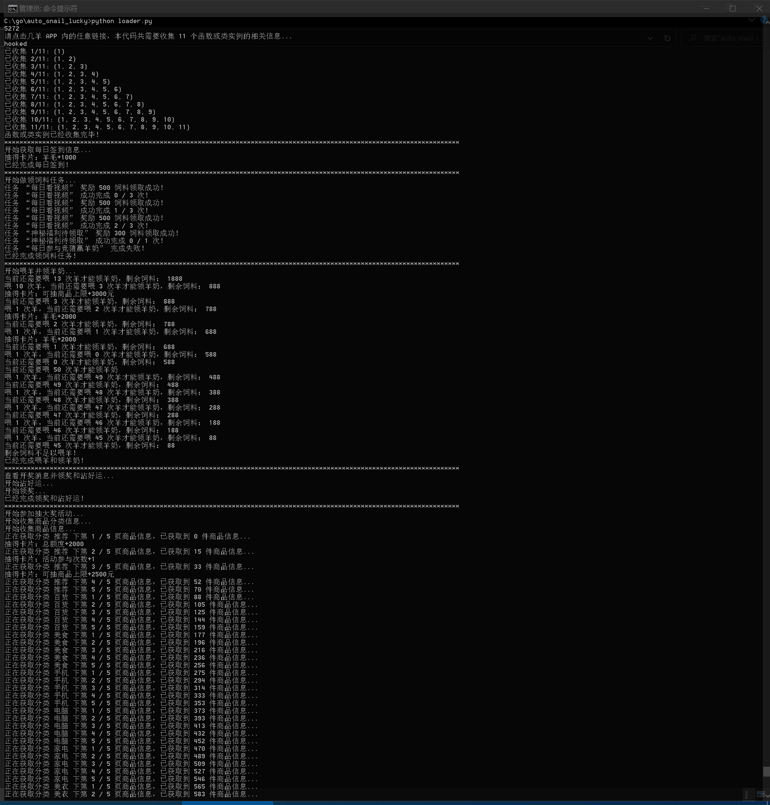
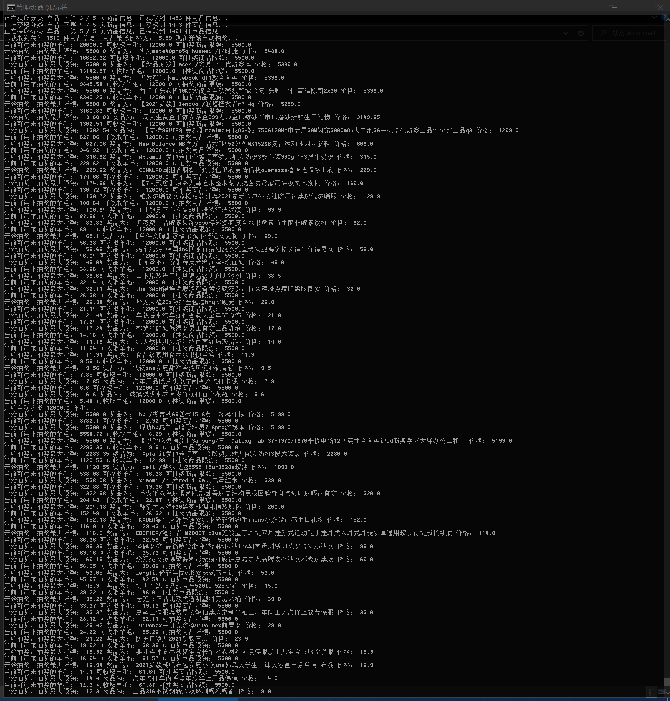

# auto_snail_lucky
# 几羊自动抽奖

# 使用方法：
以下均在Windows 10下操作：

①安装“雷电模拟器”（夜神测试了不能使用），或自备一台root过的安卓手机，在自带的应用市场搜索并安装“几羊”APP，登录自己的几羊账号，注意雷电模拟器打开几羊后不要更新。

②下载[安卓 SDK Platform Tools](https://developer.android.google.cn/studio/releases/platform-tools)，解压到C:\platform-tools，设置系统环境路径（Win+Break快捷键，高级系统设置，环境变量，系统变量里面的Path添加C:\platform-tools）。

③下载[Python3.x](https://www.python.org/downloads/)，安装后Win+R，输入cmd+回车打开命令行工具，输入以下命令：

pip install -i http://mirrors.aliyun.com/pypi/simple frida

pip install -i http://mirrors.aliyun.com/pypi/simple frida-tools

pip install -i http://mirrors.aliyun.com/pypi/simple requests==2.20

④下载[frida-server](https://github.com/frida/frida/releases/)，注意区分版本，可以这样区分：

a.手机通过USB连接电脑，或打开雷电模拟器

b.打开命令行工具，输入adb devices，如果没有发现设备，请自行查找解决方案

c.输入adb shell，进入安卓命令行后，如果是真手机，输入su进入root权限账号，提示符会从$变为#，如果是雷电模拟器可不用操作。

d.输入getprop ro.product.cpu.abi：

**1.如果是armeabi-v7a，下载frida-server-x.x.x-android-arm.xz**
  
**2.如果是arm64-v8a，下载frida-server-x.x.x-android-arm64.xz**
  
**3.如果是x86，下载frida-server-x.x.x-android-x86.xz**
  
**4.如果是x86_64，下载frida-server-x.x.x-android-x86_64.xz**
  
  输入exit退出安卓命令行
  
e.解压以上下载的文件，输入命令：adb push frida-server-x.x.x-android-x /data/local/tmp/，其中frida-server-x.x.x-android-x为对应的frida-server文件名

f.再次输入adb shell进入安卓命令行，输入su进入root，然后输入以下命令运行frida服务：

\# cd /data/local/tmp/

\# chmod 777 frida-server-x.x.x-android-x

\# ./frida-server-x.x.x-android-x

⑤git clone https://github.com/tzwsoho/auto_snail_lucky 克隆本工具源码，然后执行以下命令并按提示操作即可开始自动抽奖：

python loader.py

以上操作正常的话效果如下图所示，本脚本目前会从最大可以抽取的奖品价格开始自动抽奖，直到消耗完所有的羊毛为止，组团抽奖还在制作当中，

# 祝各位大老爷们都可以抽中大奖！！！

# 如果有大老爷使用本脚本抽中大奖，或是想支持本脚本的持续开发，欢迎给本人打赏支持！！！

