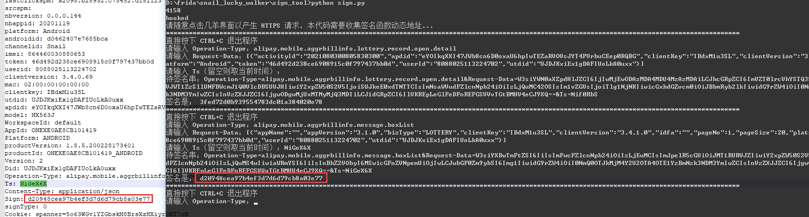

# sign_tool
# 请求签名计算工具

# 使用方法：
以下均在Windows 10下操作：

①先装好安卓 SDK platform tools、python 3.x、frida-server，具体步骤参照首页的README

②在本目录下执行python sign.py，然后随意点击几羊APP，让脚本先收集签名函数地址，然后输入要签名的信息再按下回车即可计算出结果。

本脚本修改后可应用于所有阿里系的APP，效果图如下：

可以看到计算的结果与拦截到的请求签名一致