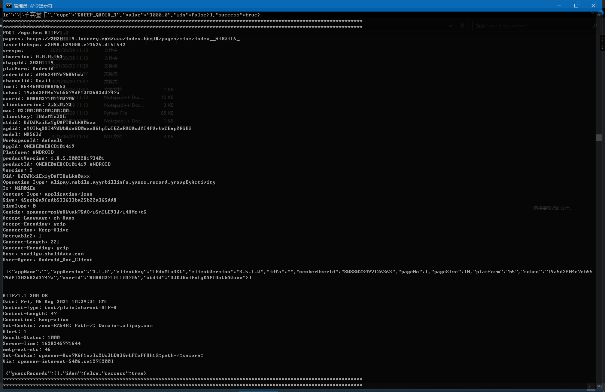

# ssl_tool
# ssl 通讯拦截工具

# 使用方法：
以下均在Windows 10下操作：

①先装好安卓 SDK platform tools、python 3.x、frida-server，具体步骤参照首页的README

②在本目录下执行python ssl.py，然后随意点击几羊APP，其所产生的 SSL 请求/响应信息均会被解密并显示出来

本脚本修改后可应用于所有使用openssl api的APP，效果图如下：

